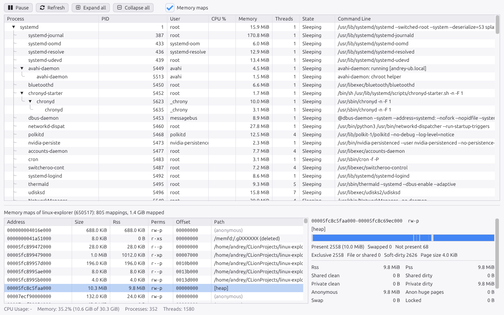

# linux-explorer

[](https://github.com/andpar83/linux-explorer/actions/workflows/ci.yml)

A Linux counterpart of Sysinternals **Process Explorer**: a live, hierarchical view of every
process on the machine with CPU, memory, owner and command line, and (eventually) drill-down
into threads, file descriptors, memory maps, sockets and environment. Data comes straight from
`/proc`; the UI is Dear ImGui on SDL3 + OpenGL.



Status: early. Today it shows the process tree with PID, user, CPU %, memory, threads, state
and command line, refreshing every second; the memory maps of the selected process in a lower
pane with their page accounting; and for a selected mapping, which of its pages are resident,
swapped or absent, in a light or dark theme that follows the desktop. See `CLAUDE.md` for
goals, rules and roadmap.

## Install

Ubuntu 26.04 or newer: download the `.deb` from the
[latest release](https://github.com/andpar83/linux-explorer/releases) and install it:

```sh
sudo apt install ./linux-explorer_*.deb
```

It pulls in SDL3 and recommends the Ubuntu or Noto fonts; `fonts-font-awesome` adds toolbar
icons. Linux Explorer then appears in the application menu and as `linux-explorer`.

## Build

Requirements: GCC 15 (`g++-15`, selected automatically), C++23, CMake >= 3.30, SDL3.

```sh
sudo apt install libsdl3-dev fonts-font-awesome   # fonts-font-awesome is optional (toolbar icons)
cmake --workflow --preset release   # configure + build + test
./build/release/src/linux-explorer
```

Other presets: `asan`, `tsan`, `ubsan`, `debug`, `analyze` (`cmake --list-presets`). If
`cmake` isn't on PATH, CLion's bundled copy works (see `CLAUDE.md`), or
`sudo apt install cmake ninja-build`.

## Usage

```
linux-explorer                       the window
linux-explorer --print-tree          process tree as text, like pstree
linux-explorer --print-maps PID      memory maps of a process as text, like pmap ("self" works)
linux-explorer --select PID          open with that process selected
linux-explorer --select-mapping M    ... and mapping M of it (hex address or a path like "[heap]")
linux-explorer --theme dark          force a theme (default: follow the desktop)
linux-explorer --screenshot x.ppm    render the window to a file and exit
linux-explorer --proc-root DIR       read a recorded /proc tree instead of the live one
```

In the window: click a process to see its memory maps in the lower pane (**Ctrl+M** shows or
hides it, drag the divider to resize); click a mapping to see its pages on the right. Only your
own processes can be inspected unless you run as root. **Space** pauses/resumes live updates, **F5** refreshes,
arrows and double-click expand/collapse nodes, columns can be resized, reordered and hidden
(right-click the header; the maps pane has end address, device and inode columns hidden by
default). Column layout is remembered in `~/.local/share/linux-explorer/`.

## CLion

Open the project directory. CLion's default `Debug` profile works out of the box. CLion also
picks up `CMakePresets.json`; enable the presets you want in *Settings | Build, Execution,
Deployment | CMake* (at least `asan`, which is how you get sanitizers inside the IDE).
`.clang-format` and `.clang-tidy` are applied by the IDE automatically.

## License

MIT, see `LICENSE`. Dear ImGui (MIT) and Catch2 (Boost) are downloaded at build time; SDL3
(zlib) comes from the system.
